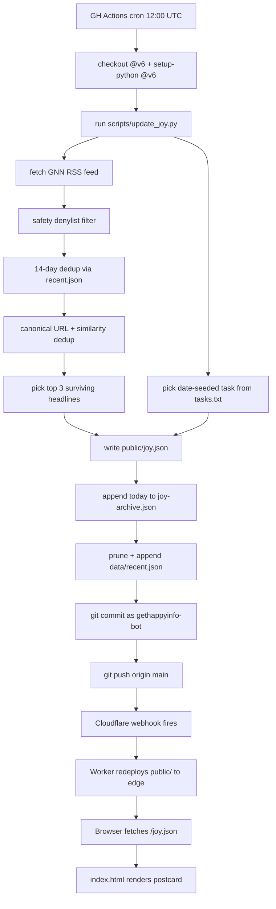
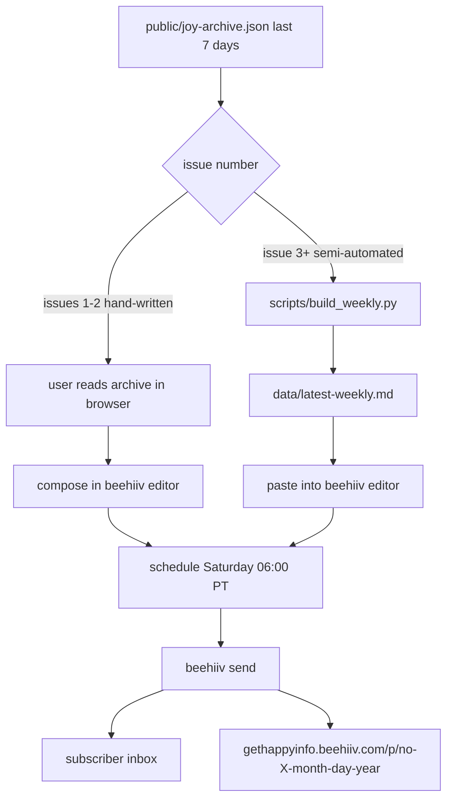

# gethappyinfo.com

A pocket-sized daily postcard from the internet: one small kindness to try today and three pieces of good news from the world, rendered as a single-file editorial postcard at gethappyinfo.com. Updated automatically every morning, free, no signup required.

## What it is

gethappyinfo.com is a deliberately tiny public-good website. Each day it publishes one artifact: a stamped postcard containing one micro-joy task (e.g. "Compliment the next person you see") and three good-news headlines pulled from Good News Network. The audience is anyone who wants a daily palette-cleanser from the firehose — no account, no algorithm, no tracking, no upsell. Permalinks at `/YYYY-MM-DD` let readers share a specific day. A companion weekly digest ("the bouquet") goes out Saturday mornings via beehiiv.

## Architecture

**Static site + daily updater.** The entire site is a single self-contained `public/index.html` (inline CSS, inline JS, inline SVG stamp, no framework). All editorial state lives in two JSON files: `public/joy.json` (today's payload) and `public/joy-archive.json` (append-only history keyed by ISO date). A stdlib-only Python script, `scripts/update_joy.py`, runs daily via GitHub Actions cron, fetches the Good News Network RSS feed, filters for safety and dedup, picks a date-seeded micro-joy task from `data/tasks.txt`, and rewrites the JSON files. The bot commits as `gethappyinfo-bot` and pushes to GitHub main.

**Cloudflare Worker + Static Assets.** Deployment is Cloudflare Workers (not legacy Pages) configured by `wrangler.jsonc`. The Worker has no `main` entry — it serves `public/` directly as static assets, with `not_found_handling: "single-page-application"` so client-side `/YYYY-MM-DD` archive routes resolve to `public/index.html`. The CF build pipeline redeploys on every push to `main`. Custom domains: `gethappyinfo.com` (apex) and `www.gethappyinfo.com`.

**Newsletter + email.** The weekly digest is sent from beehiiv (publication: `gethappyinfo`). The brand inbox `hello@gethappyinfo.com` is served by iCloud+ Custom Email Domain — iCloud+ owns the root zone's MX/SPF, so any future beehiiv custom-sender DNS must live on a subdomain (`news.gethappyinfo.com`) to avoid breaking inbound mail to `hello@`.

## Repository structure

```
gethappyinfo-com/
├── README.md                          Human-facing project overview (legacy CF Pages notes still inside).
├── wrangler.jsonc                     CF Worker config: static-assets-only, SPA fallback, compat 2026-05-28.
├── .gitignore                         Excludes __pycache__, .wrangler, .dev.vars*, .env*.
├── public/                            Worker static asset root (served at apex).
│   ├── index.html                     Single-file site: inline CSS/JS/SVG, postcard UI, archive routing.
│   ├── joy.json                       Today's payload {lastUpdated, dailyTask, topNews[]}.
│   ├── joy-archive.json               Append-only history {days: {"YYYY-MM-DD": <joy.json>, ...}}.
│   └── stamp-square.svg               1024x1024 standalone stamp asset (for social/favicon).
├── scripts/
│   └── update_joy.py                  Daily updater. Python 3.12 stdlib only. Fetch/filter/dedup/write.
├── data/                              Build inputs, not served.
│   ├── tasks.txt                      Micro-joy task pool (~99 lines, # comments allowed).
│   └── recent.json                    14-day rolling URL ledger for cross-day dedup.
├── .github/
│   └── workflows/
│       └── daily.yml                  Cron 12:00 UTC. checkout@v6, setup-python@v6, run + commit + push.
├── assets/                            Local-only brand source; not served, not in build.
│   ├── bunch-of-flowers.png           Brand source image.
│   └── get-happy-info-avatar.png      1024px avatar PNG.
├── test/                              Local-only mockups; not served.
│   ├── GHI_logo_wide.png              Wide-logo mockup.
│   └── GHI_stamp.png                  Stamp mockup (reference for inline SVG).
└── docs/
    └── README.md                      This document.
```

## Daily update workflow

GitHub Actions cron fires at `0 12 * * *` UTC (≈05:00 PDT). GitHub may delay or drop scheduled runs under load — observed runs land 1.5–5 h late — so a manual `workflow_dispatch` is the reliable stopgap. The updater is degrade-safe: on RSS fetch failure or zero-fresh-picks, it carries over the previous day's `topNews` while still rotating the daily task. Task selection is Pacific-day stable via `date.toordinal() % len(tasks)`.



Note: `daily.yml` currently stages `public/joy.json` and `data/recent.json` only. `public/joy-archive.json` is written by the updater but not added by the workflow — local runs commit it manually. Adding it to the workflow's `git add` line closes the gap.

## Newsletter workflow

Issues 1–2 are hand-written in the beehiiv WYSIWYG (the format is not yet frozen). From issue 3 onward, a stdlib `scripts/build_weekly.py` will render a beehiiv-pasteable markdown digest from the last seven days of `joy-archive.json`. The send always goes to both email and the beehiiv web post.



## Operational notes

### Deadlines

- **2026-06-11** — beehiiv Max trial expires. Downgrade to FREE before this date; do not let it auto-charge.
- **After issue 2 sends** — freeze the weekly format, then build `scripts/build_weekly.py` (stdlib only, Saturday 06:00 PT cron, reads `joy-archive.json`).
- **After ~4 issues** — ship the on-site weekly archive at `gethappyinfo.com/weekly/` (deferred to avoid thin-content SEO penalty).
- **>500 subscribers** — threshold to justify beehiiv Scale ($39/mo) for full API automation via `POST /publications/{id}/posts`.

### DNS warnings

`hello@gethappyinfo.com` is served by iCloud+ Custom Email Domain, which owns the root MX/SPF. Do **not** add beehiiv DKIM/SPF on the root `gethappyinfo.com` zone — inbound mail to `hello@` will start bouncing. When the time comes to send beehiiv from a branded sender, set up DNS on the `news.gethappyinfo.com` subdomain first; only then click beehiiv's "Set up custom domains → Email". Do **not** re-add Cloudflare Email Routing for this domain (iCloud+ replaced it and the records will conflict).

### Cloudflare deploy fragility

The Workers + Static Assets + Git Builds path silently disconnects its GitHub webhook. Symptom: every entry in the Worker's Deployments tab reads "Manually deployed" with no "Git push" entries — the webhook is dead. There is no email or surface alert; the only signal is a banner inside Worker → Settings → Build. Fix: disconnect and reconnect Git from that screen (there is no "Reconnect" button). Hard fallback: GH-Actions `npx wrangler deploy` with a `Workers Scripts:Edit` CF API token stored as a GitHub secret. For new static sites going forward, pick the Pages flow explicitly rather than the Workers & Pages default.

## V3 — content library (2026-06-01)

V3 turns the single ephemeral postcard into a crawlable, agent-readable library:
every fresh news pick and every micro-joy task gets a permanent static page carrying
an **original Get Happy-voice writeup** (never the source's text), plus full SEO and
agent-discovery plumbing. Plan + dual-reviewer (Codex + Gemini) audit trail:
`~/.claude/plans/i-want-to-discuss-piped-thimble-v4.md` (accepted artifact).

**How it works (extends `scripts/update_joy.py`, still stdlib-only):**
- `fetch_feed()` now also captures each item's `<description>` excerpt, `<creator>`
  byline, and `<pubDate>`. The excerpt (GNN's syndicated intro, boilerplate stripped)
  is the **only** grounding for the summary — we never store or publish the body.
- `summarize_story()` calls **Cloudflare Workers AI — Kimi K2.6 with reasoning off**
  (`chat_template_kwargs.thinking:false`) via stdlib `urllib` POST to the Workers AI
  REST API (free tier; token in `CLOUDFLARE_API_TOKEN` secret + `CLOUDFLARE_ACCOUNT_ID`;
  no SDK). The voice + exact prompts live in `scripts/voice.md` (edit voice there; the
  pipeline follows). Model chosen by a 6-model bake-off; see [[v3-content-library]].
- **One canonical gate-failure rule:** any failure — API error, hallucinated number
  (groundedness), too-thin (<60 words original copy), near-duplicate (ratio >0.60),
  headline too close to source (ratio ≥0.70) — **skips that page and logs to
  `data/generation-log.json`** (180-day pruned). Never blanks the postcard.
- **Write order is invariant:** `joy.json` is written first; all summarization +
  rendering happen after, fully wrapped — page-gen can never fail the daily run.
- **Generate-once:** a page file that exists is never re-worded. Story slug = source
  URL's last path segment (stable); kindness slug is frozen in `data/kindness-slugs.json`.
- **Cumulative plumbing** (regenerated each run by globbing the page dirs):
  `sitemap.xml`, `robots.txt`, `llms.txt` (llmstxt.org format), `index.json` (agent feed).
- **Internal nav:** `today-pages.json` lets the postcard add an "our take" link per
  headline + link the task to its kindness page — additive, no `joy.json` change.

**New files:** `scripts/voice.md`, `public/page.css`, `public/story/<slug>/index.html`,
`public/kindness/<slug>/index.html`, `public/sitemap.xml`, `public/robots.txt`,
`public/llms.txt`, `public/index.json`, `public/today-pages.json`,
`data/kindness-slugs.json`, `data/generation-log.json`, `test/test_update_joy.py`.

**One-time:** `python scripts/update_joy.py --build-kindness` generates the ~99
evergreen kindness pages (review before committing). Tests: `python test/test_update_joy.py`.

**Crossed invariants (deliberate):** no-LLM, no-build-step, no-navigation,
single-file-site, no-external-service — all crossed; stdlib-only (no pip) preserved.

## Locked design decisions

- **Brand mark.** Postal-red smiling sun (`#a13a2b` body, cream `#efe6d2` eyes/smile, 8 rays) on cream-yellow stamp (`#f5ecd6`) with perforated edges. Wordmark Fraunces + IBM Plex Mono `INFO.COM` in ocean blue `#36556b`. Favicon: sun-with-face emoji.
- **Palette.** Cream paper `#EFE6D2`, postal red `#A13A2B`, ocean `#36556B`, kraft `#C4A884`, light cream `#FAF6EB`. No cold grays.
- **Typography.** Fraunces (display), Caveat (signature "~ the day"), IBM Plex Mono (postal marks). Beehiiv body matches site (Fraunces).
- **Share button text.** `✉ pass it on ↗` — locked. Never lose the envelope glyph or the postcard register.
- **Weekly URL slug.** `no-{X}-{month-abbrev-lower}-{startday}-{year}` (e.g. `no-1-may-24-2026`).
- **Weekly meta title.** `No. {X} · {issue phrase} — Get Happy Info` (≤60 chars).
- **Beehiiv template.** "The Weekly Edit" with palette mapped (core cream, primary postal red, secondary ocean, tertiary kraft, accent light cream); Fraunces body; IBM Plex Mono button.
- **Subscribe copy.** Headline `Get the weekly bouquet` / subhead `One short letter, every Saturday morning.` / placeholder `your email`.
- **Sender + reply-to.** Sender name `Get Happy Info`. Reply-to `hello@gethappyinfo.com` (iCloud+).
- **Address privacy.** Use beehiiv's virtual mailbox in every footer. Never the user's home address, never a friend's address.
- **Substack avoidance.** Default newsletter platform is beehiiv. Both Substack accounts were suspended 2026-05-28; do not recommend Substack unless explicitly revisited.
- **Stack invariants.** GitHub-direct repo (`WolfNinja32/gethappyinfo-com`), no Gitea mirror. Stdlib-only Python updater (no pip packages, no Node) — *preserved in V3*: the Workers AI call uses `urllib`, not an SDK. **Free resources only** — Workers AI runs on the Cloudflare free tier (no paid API; the earlier Anthropic/Haiku build was removed for violating this). V3 crosses "no LLM" (Kimi writes summaries), "no build step" (HTML rendering), "single-file site" (multi-page), and "no external service dependency" (Workers AI — but degrade-safe: the daily postcard never hard-depends on it). GH Actions pinned to `checkout@v6` + `setup-python@v6`.

## Anti-patterns

- Do not re-add the cartoon brand mark (teal speech bubble + blue "i" badge + multi-color rays). Discarded 2026-05-28.
- Do not introduce speech bubbles, "i" badges, or multi-color rays anywhere in the brand system.
- Do not put beehiiv DKIM/SPF on the root `gethappyinfo.com` zone — it conflicts with iCloud+ Custom Email Domain.
- Do not re-add Cloudflare Email Routing for this domain.
- Do not reference any other Substack account in a Substack support ticket — the anti-abuse system reads it as duplicate-identity.
- Do not create a second Substack account for a new brand; use Publications under one account.
- Do not put the user's home address in any newsletter CAN-SPAM footer or public archive page.
- Do not use white or cold-gray (`#DFDFDF`, etc.) in the palette. Postcard palette has no cold neutrals.
- Do not click "Generate with AI" or pick beehiiv preset palettes/font pairs — both regress to SaaS-generic.
- Do not revert beehiiv copy to platform defaults ("Subscribe to our free newsletter", etc.).
- Do not add LLM *curation/ranking*, analytics, or email capture to the site. (V3 — 2026-06-01 — deliberately crossed "no LLM" and "no navigation": Kimi K2.6 (free Workers AI) writes per-page *summaries* (not ranking), and the postcard now links to story/kindness library pages. See "V3 — content library" below. Multi-source aggregation arrived in V2.)
- Do not automate the weekly digest before issue 2 sends.
- Do not roll GH Actions back to `checkout@v4` / `setup-python@v5` (Node 20 deprecation 2026-06-02).
- Do not mirror this repo to Gitea — daily bot commits would be clobbered by force-mirror.

## Future work

1. **Hand-write issue 2** next Saturday in beehiiv. Lock the weekly format only after it sends.
2. **Build `scripts/build_weekly.py`** after issue 2 ships. Stdlib only. Saturday 06:00 PT cron. Reads `joy-archive.json`, writes `data/latest-weekly.md` for paste-in.
3. **Fix the workflow gap.** Add `public/joy-archive.json` to `daily.yml`'s `git add` line so the archive grows automatically.
4. **Ship `/weekly/` on-site archive** after issue 4 (avoid thin-content SEO penalty).
5. **Evaluate beehiiv MCP** the week of 2026-06-06, after issue 2 sends. Verify it's available on the free tier, not just Max trial.
6. **Defer beehiiv custom-domain `weekly.gethappyinfo.com`** until after issue 6 AND ≥50 subscribers.
7. **Add weekly signup button on site** once daily uniques exceed ~100 sustained for a week.
8. **Re-evaluate beehiiv Scale ($39/mo)** only past 500 subscribers, for full API automation.

## Related memory

- `~/.claude/plans/this-is-from-a-sparkling-moth.md` — the approved build plan. Do not regenerate from scratch.
- `/Users/gregory/Developer/Fortress/signet.md` — universal agent instructions (working style, rules).
- `/Users/gregory/Developer/Fortress/SITREP.md` — current operational state across all Fortress products.
- `/Users/gregory/Developer/Fortress/Products_status.md` — product status and priorities (this project's row).
- `/Users/gregory/Developer/Fortress/docs/lessons-learned.md` — append-only lessons database; check before diagnosing.
- `/Users/gregory/Developer/Fortress/docs/home-lab-inventory.json` — infra inventory (unused by this project, but canonical for machine decisions).
- `/Users/gregory/Developer/Fortress/assets/brand/` — Fortress-wide brand standards (separate from gethappyinfo postcard brand).
